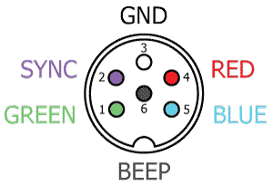
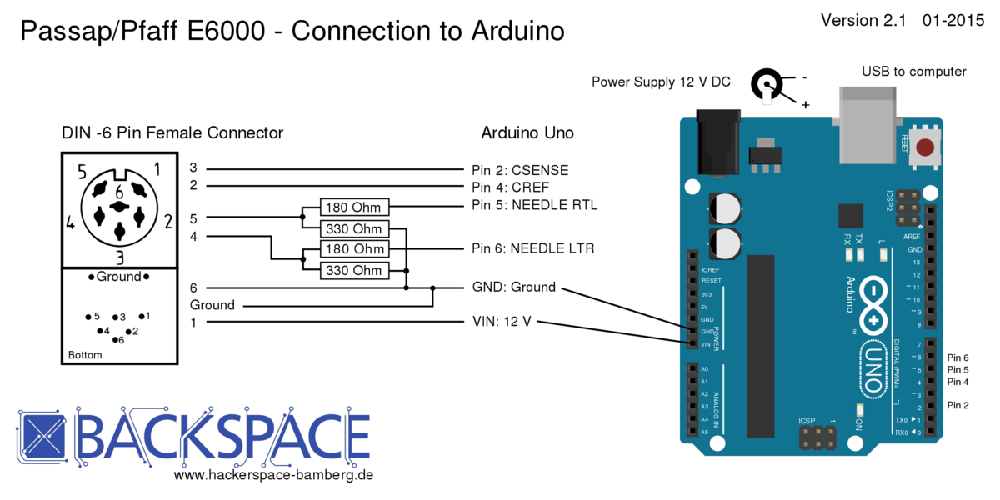
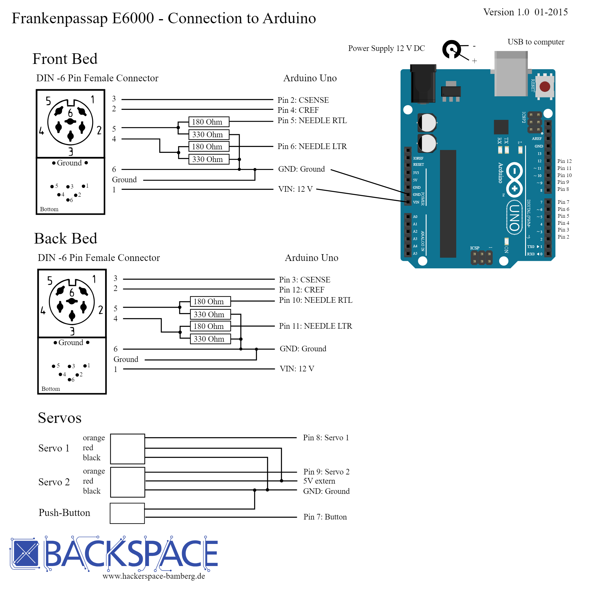

# Passap gögn
Kortlagning í formi dagbóka færslna af samasöfnuðum gögnum fræa veraldar vefnum.

Það eru tvennir hugar í þessum heimi:
* Croucher og Knitterstream.
	*	Hlaða inn .cut skrám með hámarkslengd og breidd
	*	Interface svo við consolið til að ná automation
* Bamberg og Irene.
	*	Fjarlægja consolið og tengja allt í arduino
	*	Lesa staðsetningu frá ljósa skynjurum
	*	Stýra nálum sjálf með innbygðu seglunum
Sjá dagbók hér að neðan.

# Passap E6000


# 2/5/24

Samskipti helgu við Chris ofthestreet og
Annacroucher
## TODO, Hvað er?
* WinCrea
* KnitterStream
* DIN port
* Hvaða útgáfu erum við með?

<!-- `Creating our own circuit board, since arduino is too bulky and attaching that into the console` -->

### DIN port
Í tölvupóstasamskiptum er mynd þar sem sýnt er 6 pin DIN port.



### WinCrea
forrit til að gera hannanir fyrir Passap e6000 outputar .cut fileum sem er síðan hægt að h
### KnitterStream
* Notast við arduino til að interface við takka á stýringu.
* Hleður inn skrám eins og hægt er í chipset 23+ 

### Hvaða útgáfu erum við með?

Croucher vill að maður viti hvaða chipset vélin hefur en lýsingar til að komast að því eru óskýrar og krefjast jafnvel þess að rífa hana í sundur sem ég hef ekki leyfi fyrir enn.

## Chipset test
[Diana Natters umfjöllun um passap e6000](https://diananatters.blogspot.com/2010/10/passap-e6000-battery-chipset.html)


If it says MEMO, then start at step 1.

Þegar vélin er ræst kemur upp MEMO

Vélin öskrar og við fáum error 213.

Hún getur því ekki tekið við niðurhöluðum skrám.

## Croucher

Við erum með id 7041398 > 7037001.
Skv skjölum frá croucher eigum við því að vera með download og 32kb minni. En testið sem ég gerði frá diönu gaf error 213. Las yfir documentation fræa croucher aftur og hann seigir að error 213 sé rétt. Rámaði í það að ég hefði séð þessa tölu áður. Diana skrifar óskýrt en þetta er þá komið núna. Við erum með stuðning við að downloada patternum.

Það eru til mismunandi týpur af vélinni.
Það var bætt við download support frá MSDOS og auka minni í nýrri vélunum.
Það er hægt að uppfæra í það og kaupa frá honum íhluti til þess. Hann mæli eindregi með því að maður leggji ekki í það að uppfæra minnið og virðast ekki vera miklir kostir til þess.

Hægt er að hlaða niður skjölum, .cut sem innihalda
leiðbeiningar um lita munstur upp að 4 litum.
0,1,2,3
Leiðbeiningar um uppsetningar slíkar skrár eru í skjölum sem croucher sendi.


Það skjal inniheldur header með 10 stöfum og svo munstrið.

* Litafjölda stafur [0,3,4]: HEX[30,33,34] = [1-2,3,4] Litir
* Bil: HEX[20]
* Breidd munsturs/dálkar á bilinu [bil,bil,1] til [1,8,0]
* Bil
* Lengd munsturs/raðir á bilinu [bil,bil,1] til [2,5,5]
* Bil
* Litamunstur þar sem hver tala merkir lit 0-3

Hef það á tilfinningunni að við séum með eldri týpu annars væri ég ekki að lesa tölvupósta frá 2014.

## Irene
[Irene](https://hackaday.io/project/163701-passap-e6000-rebuilt-and-replaced-console/details)
[Irene repo](https://github.com/IrenePassap/Passap-E6000-hacked-and-rebuilt/blob/master/Passap_Projekt_Raspberry_Pi_Version_36.3_23.7.21.py)

Hún notar eina raspberry pi sem stýrir svo þrem arduino vélum. ein fyrir motor til að færa fram og til baka, ein fyrir fremri 'lock' til að prjóna og aðra fyrir aftari 'lock'.

Hún er búin að breyta vélinni þannig að aftara borðið er eins og fremra og getur þá líka prjónað eh meira fancy.

Hún vitnar í [bamberg](https://www.hackerspace-bamberg.de/Passap_pfaff_e6000)
.

Bamberg talar 'lightbarriers' í "carriage" til að vita staðsetninguna.

Finnst líklegt að við þurfum bara einfaldlega að losta okkur við upprunalgeu stýringuna eins og aðrir hafa gert. Þá kemur upp vandamál Croucher um að þú þarft í raun að forrita allt frá grunni með mikilli vitneskju um prjón og vélbúnaðinn.


## Niðurstöður // Summary

Erum með stuðning við að downloada .cut fileum.

Höfum 32k chip en 20k minni skv nýtni áætlun croucher.

Irene og bamberg hafa fjarlægt consolið gjörsamlega og smíðað sitt eigið með raspberry pi.

Ég held að við viljum halda consolinu og allri tækninni þar inni. grf.

Spurning um að bæta þá ofaná eh stýringu sem interfacer við consolið. Skoða knitterstream betur.


# 3/5/24

Byrjum á að skoða Irene og Bamberg betur.

* [Bamberg Github](https://github.com/knitty/firmware/tree/master/software/Knitty)
* [Bamberg lýsing (þýsk)](https://www.hackerspace-bamberg.de/Passap_pfaff_e6000)
* [Irene Github](https://github.com/IrenePassap/Passap-E6000-hacked-and-rebuilt)
* [Irene dagbók](https://hackaday.io/project/163701-passap-e6000-rebuilt-and-replaced-console/details)


## Diagram
### Bamberg


Arduino unoinn kemur í stað stýringarinar 'consolsins' og notast þeir við sitt eigið forrit sem þeir gerðu fyrir alíka vél sem heitir [knitty](https://www.hackerspace-bamberg.de/Knitty)

Þeir eru líka með sér arduino fyror Autocolor, hvort hann hafi verið eh bilaður hjá þeim. Sé þetta ekki hjá Irene



[`Hægt er að sjá .svg diagram myndir frá Bamberg`](https://github.com/knitty/firmware/tree/master/hardware)

### Irene

Irene byggir á Bamberg en í stað þess að vera með tölvu usb tengda í arduino uno þá er raspberry pi með notendaviðmót sem stýrir

Lesa kóðan þeirra og skilja hvernig þau eru að lesa inn staðsetningu með pinum frá ljósunum. Þetta virðist ekki flókið en erfitt að ná hausnum almennilega utanum þetta án  þess að fikta sjálfur.

<a href="https://hackaday.io/project/163701-passap-e6000-rebuilt-and-replaced-console/details" style="text-align:center;">Sjá meira hjá Irene</a>
Light sensorinn skýnir ljósi í 2mm göt á guiderail, 3mm á milli gata, 5mm er ein nál.

út frá munstri er hægt að lesa staðsetningu og átt lásins.

Ég bætti við Repoinu hennar Irene og bamber hér í möppu, til að auðvelda mér að fina efnið og rýna í það.


# 6/5/24

## Irene
Raspberry with two arduino sem stýra sitthvorum lásnum.
Hann stýrir svo mótornum. Það er ekkert samband á milli mótors og lása.

Mótorinn ýtir lásonum fram og til baka eins og ef noandi væri að gera það með hendinni og
lásarnir eru með ljós skynjara sem þeir nota til að lesa átt og staðsetningu.

Irene notast við technique.txt skrár fyrir gerð af prjóni?
Sva aðra skrá fyrir pattern.

Kóðarnir hennar eru torlesnir og gætu verið mun betur skrifaðir. Allar breytur eru global. Numpy er ekki notað fyrir fylki heldur forlykkju viðbjóður.

Ég tek það á mig að fara í gegnum þetta línu fyrir línu og endurskrifa allavega python kóðan uppá skilning fyrir mig. Besta leiðin til að skilja eitthvað er að laga það.

Þetta endar alltaf á því að maður þarf að fikta og prufa sig áfram.

Ég er búin að minnka fyrstu 800 línurnar niðu í minna en 200 með einfaldri notkun á numpy og skilning a fylkja notkun. Hægt er að sjá hreinskrifuðu útgáfuna undir möppunni Irene með nafninu controler-elli-cleanup.py

ég held áfram með þetta á morgun eftir hreinsun á vél

# 7/5/24

Þrif og teambonding

# 8/5/24

Punktar um gpio merki.

Til að fá gpio input í program er hægt að framkvæma "polling".
Getur misst af inputi ef gidli er lesið á vitlausum tíma.
Gert í lykkjum og er mögulega íþungt á keyrslu umhvefið.
Öunnr aðferðir er að nota "interrupts" sem tekur eftir muninum á milli breytingum, frá hi to low (falling) frá low to hi (rising)


Kláruðum að þrífa.

Skoðaði betur munninn á tölvu og mekanísku útgáfunni frá Passap.

Tölvu útgáfan er með 
- 2 input, ljósskynjararnit tveir sem staðsetjan
- 2 output, seglar sem raða nálum fyrir munstur næstu línu
Sameiginlegt er
- Mekaníkinn sem ýtir nálonum upp er sú sama.
- nálabeðið er óbreytt

# 10/5/24

Öll ljós slökkt og ekki sál að sjá.

Er komin með 250 línur af hreinskrifaðari kóða útgáfu frá Irene.

Er að bryja á tech array hjá henni.


Hér útskýrist betur þessi blessaði tech array file hjá henni.

fyrstu tvö gildin lýsir hún sem skipun um að byrja pattern á nýrri línu.

```
    x = tech_Array[countTech][0]
    x = int(x)
    rowCount_VNB = int(rowCount_VNB) + x
```

Þar sem rowcount_VNB er nr línu á fremri lásnum.
countTech er lína í tech file, 0 er index á fyrstu tölunni

Næst koma hvaða lita vigra hún nota.
Þar er gefin strengur sem er enumaður á skipun sem sendir viðeigandi vigur á viðeigandi Arduino.

V - fremri, H - Aftari

Svo er stillingin sem að lásin á að vera í. Hún stilir það sjálf

svo skipanir til að skipta um lit, sem ég skil ekki alveg.

Hún seigir að þetta sé boolean já og nei fyrir skipti og stop en þegar hún skiptir um lit breytast þesssi gildi ekki neitt.

svo bara info dump, þetta væri vel hægt að sleppa.

Virkni segla lásins voru í raun sanreynd í prufunum í dag. 
Hann stillit uppröðunninni fyrir næstu umferð. Default er 1 þarf að senda 0 til að setja í hvildarstöðu.
Pusherarnir stýra svo einhvernveginn hvaða nálar eru notaðar.
Það er bara hlustað á pusherana þegar x stilling er virk og þegar kveikr er á örvum í gömlutýpunni er uppröðun þeirra breytt.

Þetta væri þá hægt að þýða yfir í kóða og sleppa motor stýringum.

Prufurnar gengu þó eh og gott að sjá mekaníkinn í virkni.

# 15/5/24

## Prototype 1

Staðan í dag, komin með arduino tengingu við lásinn. Get lesið ljósskynjara og breytt segulsviði seglana.

Þá er bara að stúttera bamberg og irene stýringarnar.


Næ að láta intterupt virka fyrir PIN_CSENSE en ekki PIN_CREF, en hann skynjar breytt gildi á báðum þannig við látum eina innterrupt rútínu virka

Fyrir Vinstri til hægri koma gildin

40 & 31

Fyrir hægri til vinstri fáum við gildin

41 & 30

Úr innterrupt rútinum hennar Irene


# 16/5/24

## Prototype 2
Ný rás fræsuð, viðnám lóðuð, tengi og pinnar.

Skynjarar í lagi, skipti út powersupply fyrir annað sem ég fann liggjandi í vr 3 og seglarnir virka.

Þá er bara eftir að útfæra kóða sem samnýtir hreyfingu

# 17/5/24

CREF er ekki tengt í pinna sem styður interrupt.

Vélin stíflaðist, tók hana í sundur, sem er fínt. Hafði langað að gera það til að sjá pusherana betur.

# 21/5/24

Horfði upp undir pusherana til að sjá hvar þeir byrja að raðast eftir stillingu. Breytti svo stillingunni og sá hversu margir pusherar voru á milli þess að breytinginn skilaði sér. Merkti þann punkt á velina og notaði hann sem calibration punkt.

Þetta er punkturinn þar sem röðun pusherana er ákveðin. Hvort þeir fara upp eða niður. Miðaði svo við þann punkt og prófaði að færa hann eitt nálarbeð í einu og breyta stillingu til að sannreyna og það gekk. 

Notaði svo ljósaskynjarann og las hvaða munstur kom úr interruptinu í hvert skipti sem ég færði calibration/samstillingar punktinn á milli nálarbeða. 

Tölugildin eru því 41 og 31 eða 11 og 01;
11: Cref=1 & Csense=1;
01: Cref=0 & Csense=1;

Til að staðsetja lásin á nálarbeðinu tökum við hann alveg út í enda. Rennum honum svo hægt inná leiðarvísirinn og greinum gildi.

Út frá því fáum við alla punkta. Það ætti að vera nóg að gera þetta bara í eina átt. Frá vinstri til hægri, horft beint á fremri lásin. Því Hægri til vinstri ætti í raun bara að telja niður sömu gildi, allavega fyrir nálarbeðin, jaðar punktarnir gætu verið annað mál. SKoðum það þegar þar að kemur

Punktar fyrir kvörðun á nálabeða ás útfrá ljósskynjara

Upphafsgildi breyturnar state & counter eru 0;
```
// direction
volatile int state = 0;
// position
volatile int counter = 0;
```

State seigir okkur um stöðu beggja ljósskynjarana og útfrá því getum við ákvarðað átt. Counter telur hverja nál og er ætlað til að staðsetja okkur.

Með state ákvöðrum við hvort við hækkum eða lækkum counter, út frá counter fáum við staðetningu

# 22/5/24

Villur lagaðar og ás nálabeðs kvarðaður.


Til að kvarða nálabeðið þarf að taka lásinn/sleðann af. Endurkveikja á arduino og renna honum á.


// 30 0
// 31 0

// 31 0
// 40 -1
// 41 0
// 40 -1
// 41 0
// 40 -1

// byrjar 31 0
// svo mynztur 40 - 41
// byrjar loks 41 - 30
// í 28 erum við komin á fyrstu nálina
// 207 seinasta nál || 206
// 243 auto color endir
// 221 útaf hægri

# 23/5/24

Munztrið sem kemur þegar honum er rennt á er, 40 telur niður og 41 upp

31 - 0
40 - -1
41 - 0
40 - -1
41 - 0
40 - -1
41 - 0 // 41-30 nála munustur++
30 - 0
41 - 1

28 er nál 1 og 206 nál 179

## Kenning 

Nálabeðið er samhverft og merkt með heiltölum í báðar áttir frá miðju með 

90 nálar vinstra megin

89 nálar hægra megin

Tölvur byrja í núlli, þannig ef fyrsta nálinn vinstra megin við miðju er 0
þá er nálabeðið samhverft um hana í hugbúnaðinum það er

-89 0 89.

## Framkvæmd

Við viljum að notandinn geti skilgreint fyrstu nál til vinstri. Best væri að notandinn gæti notast við innbygpu tölurnar á vélinni.

Notandi segir að munztur byrji á nál 90 til vinstri, þá þarf það að vera 0 í munztur vigri.

setur inn -90,
sem er nál 28
### Hugmynd
```
int input = -90;
int start = (input < 0) ? input +90 : input + 89;
int line = 0;
counter - 28 - (start) = 0;
206 - 28 = 179
if (counter >= (28+start) && counter < 207)
{
	int index = counter - 28 - start;
	digitalWrite(pin,PatternMatrix[index])
	if (counter > width of matrix + start || (line>0 && counter < 28+start))
	{
		line++
	}
}

counter - 28 + input = 0
```

### útfærsla
Notobene þetta eru 178 nálar og við byrjum í 0,
þannig index er á bilinu 0-177, fyrir allar nálar á borðinu

#### Einn vídd Index
```
    int input = -90;
    int start = (input < 0) ? input + 90 : input + 89;
    int index = counter - 28 - start;
```
If var óþarfi þar sem við setjum bara núll punkt og okkur ætti að vera sama um öll önnur gildi. Þannig þótt index flæði út fyrir þá er hann ekki að stýra neinu.


Þegar ég var að prufukeyra index, var ljost að þar sem seglarnir eru ekki á samastað þá þarf að vera með sér tölu fyrir hvorn, það virðist vera 10 nála bil á milli, þannig við bara bætum við 10 á bakaleiðinni við index. einnig virtist vera 2 nála offset frá fyrstu nál og stillingar punkti, sem er innan skekkju marka mannsins.

vona ég.

ég breytti því núll punkti nálarásins í 26 til að lagfæra það.

```
		int input = -10;
		int start = (input < 0) ? input + 90 : input + 89;
		int index = counter - 26 - start;
		int value = 1;
```
##### Hægri til vinstri
```
			if (index + 10 >= 0 && index + 10 < arraysize)
			{
				value = array[index + 10];
			}
			digitalWrite(PIN_NEEDLE_RTL, value);
```
##### Vinstri til hægri
```
			if (index >= 0 && index < arraysize)
			{
				value = array[index];
			}
			digitalWrite(PIN_NEEDLE_LTR, value);

```
#### Tveggja vídda Index
Þá er það línu meðhöndlun.

Byrjum alltaf að prjóna hægri til vinstri.
Setjum alltaf lásinn/sleðann á frá vinstri til hægri.

Þurfum þá að stilla nálarnar þannig fyrst.

Þannig sleðin byrjar alltaf lengst til vinstri?
vonandi
 


